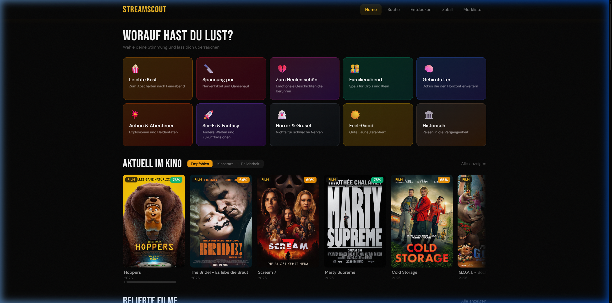

# StreamScout

<p align="center">
  
</p>

<p align="center">
  <strong>Filme & Serien entdecken — cineastisch, schnell, auf Deutsch.</strong>
</p>

<p align="center">
  <a href="https://github.com/Immanuel-l/streamscout/actions"></a>
</p>

---



## ✨ Features

| Feature | Beschreibung |
|---|---|
| 🔍 **Suche** | Film- und Seriensuche mit Autocomplete und Poster-Thumbnails |
| 🎭 **Mood-Suche** | 10 Stimmungen (z.B. „Spannung pur", „Feel-Good", „Gehirnfutter") für passende Vorschläge |
| 🧭 **Discover** | Entdecke Filme und Serien nach Genre, Jahr, Bewertung und Streaming-Anbieter |
| 🎲 **Zufalls-Generator** | Genre wählen, Button drücken, überraschen lassen |
| 📋 **Watchlist** | Filme und Serien merken (lokal im Browser gespeichert) |
| 📺 **Streaming-Provider** | Sieh auf einen Blick, wo Filme/Serien in Deutschland streambar sind |
| 🎬 **Detail-Seiten** | Backdrop-Hero, Cast, Trailer, Staffelübersichten und mehr |
| 🎞️ **Kino** | Aktuell im Kino laufende Filme |
| 🇯🇵 **Anime** | Anime-Filme und -Serien entdecken |
| ♾️ **Infinity Scroll** | Nahtloses Nachladen in Discover, Mood und Suche |

## 🛠️ Tech Stack

- [React 19](https://react.dev/) + JavaScript
- [Vite](https://vite.dev/) als Build Tool
- [React Router](https://reactrouter.com/) für Navigation
- [TanStack Query](https://tanstack.com/query) für API Calls und Caching
- [Axios](https://axios-http.com/) für HTTP Requests
- [Tailwind CSS](https://tailwindcss.com/) für Styling

## 🚀 Installation

### Voraussetzungen

- [Node.js](https://nodejs.org/) (Version 18 oder höher)
- [Git](https://git-scm.com/)
- Ein kostenloser [TMDB Account](https://www.themoviedb.org/signup)

### 1. Repository klonen

```bash
git clone https://github.com/Immanuel-l/StreamScout.git
cd StreamScout
```

### 2. Abhängigkeiten installieren

```bash
npm install
```

### 3. TMDB API Keys besorgen

1. Erstelle einen kostenlosen Account auf [themoviedb.org](https://www.themoviedb.org/signup)
2. Gehe zu den [API-Einstellungen](https://www.themoviedb.org/settings/api)
3. Beantrage einen API-Key (unter „API" im Menü)
4. Kopiere den **API Read Access Token** und den **API Key**

### 4. Umgebungsvariablen anlegen

Erstelle eine `.env` Datei im Projektverzeichnis:

```bash
VITE_TMDB_ACCESS_TOKEN=dein_api_read_access_token_hier
VITE_TMDB_API_KEY=dein_api_key_hier
```

### 5. Entwicklungsserver starten

```bash
npm run dev
```

Die App läuft dann unter [http://localhost:5173](http://localhost:5173).

## 📋 Weitere Commands

| Command           | Beschreibung                  |
| ----------------- | ----------------------------- |
| `npm run dev`     | Entwicklungsserver starten    |
| `npm run build`   | Production Build erstellen    |
| `npm run preview` | Production Build lokal testen |
| `npm run lint`    | Code-Linting ausführen        |
| `npm test`        | Tests ausführen               |

## 📁 Projektstruktur

```
src/
  api/        – Axios Instance + API Calls
  components/ – UI-Komponenten (layout, common, search, discover, detail, watchlist)
  pages/      – Seitenkomponenten (Home, Search, Discover, Mood, Watchlist, …)
  hooks/      – Custom Hooks (useMovies, useTv, useProviders, useDebounce, useWatchlist)
  utils/      – Helpers, Constants, Mood-Mappings
```

## 📄 Lizenz

Dieses Projekt nutzt Daten von [The Movie Database (TMDB)](https://www.themoviedb.org/). TMDB ist nicht verantwortlich für die Inhalte dieser App.
